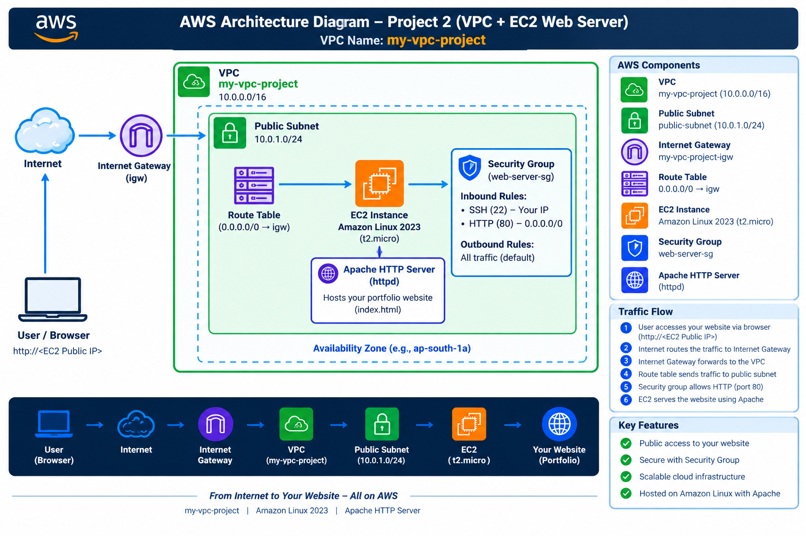
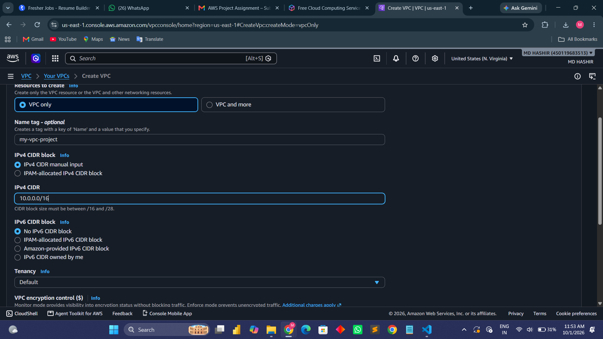
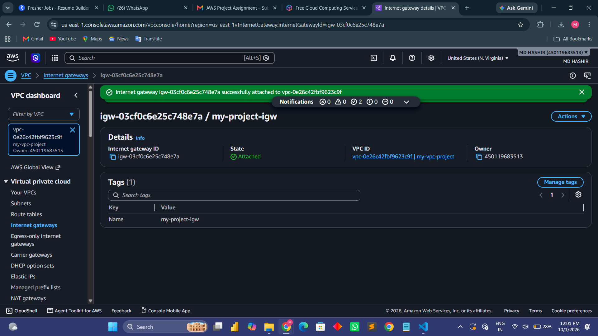
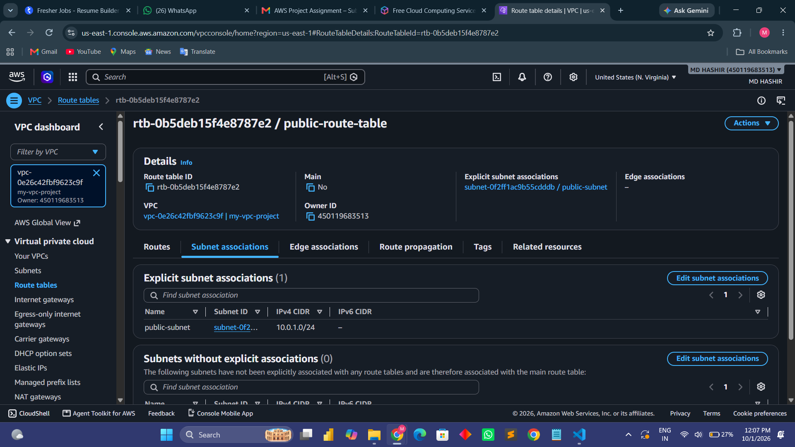
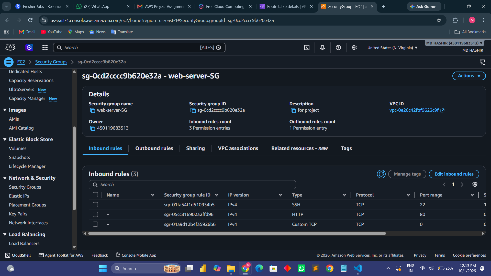
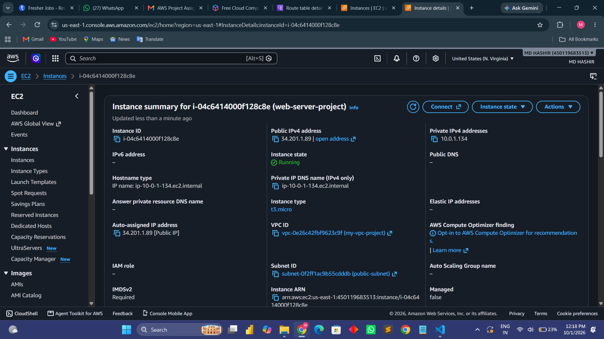
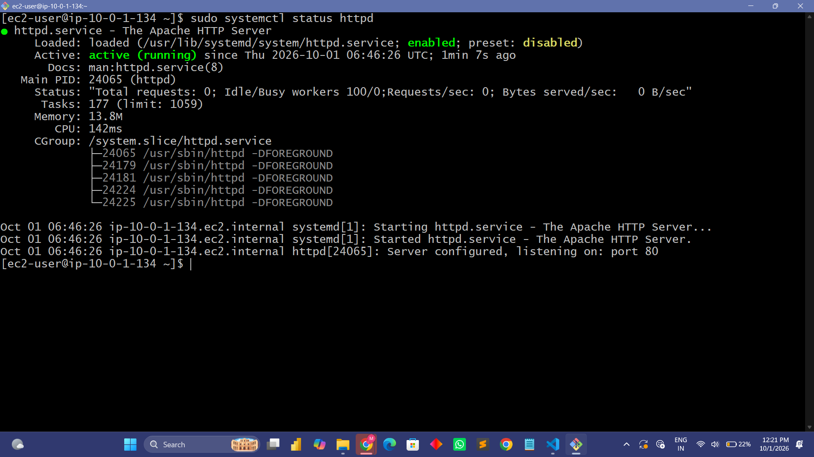
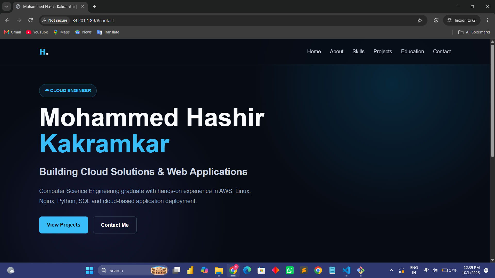

# Project 2 — Custom AWS VPC with EC2 Web Server

## 1. Objective

Create a custom Amazon VPC with one public subnet and deploy an Amazon Linux EC2 instance. Configure an Internet Gateway, public route table, and Security Group, install Apache HTTP Server, and host a basic portfolio webpage accessible through the EC2 public IP.

## 2. AWS Services Used

- Amazon VPC
- Amazon EC2
- Internet Gateway
- Route Table
- Security Group
- Apache HTTP Server on Amazon Linux

## 3. Architecture



Traffic flow:

Internet / Web Browser → Internet Gateway → `my-vpc-project` → `public-subnet` → `web-server-SG` → Amazon Linux EC2 → Apache HTTP Server → Portfolio Website

## 4. Configuration Details

| Resource | Configuration |
|---|---|
| VPC | `my-vpc-project` |
| VPC CIDR | `10.0.0.0/16` |
| Public Subnet | `public-subnet` |
| Subnet CIDR | `10.0.1.0/24` |
| Internet Gateway | `my-project-igw` |
| Route Table | `public-route-table` |
| Default Route | `0.0.0.0/0` via Internet Gateway |
| Security Group | `web-server-SG` |
| EC2 AMI | Amazon Linux |
| Instance Type | `t3.micro` |
| Web Server | Apache HTTP Server (`httpd`) |
| Web Port | TCP 80 |

## 5. EC2 Web Server Setup

Apache was installed and started on the Amazon Linux instance using:

```bash
sudo dnf update -y
sudo dnf install httpd -y
sudo systemctl start httpd
sudo systemctl enable httpd
sudo systemctl status httpd
```

The website was placed at:

```text
/var/www/html/index.html
```

The Apache service was verified as active and listening on port 80.

## 6. Security Group

The project Security Group was configured to allow web traffic on TCP port 80 and SSH access on TCP port 22. The uploaded evidence also shows an additional custom TCP rule in the Security Group screenshot.

## 7. Testing

The deployed website was tested from a web browser using the EC2 public IPv4 address:

```text
http://34.201.1.89/
```

The browser successfully displayed the portfolio webpage, demonstrating that the EC2 instance was reachable through the configured public networking path and that Apache was serving the HTML content.

## 8. Evidence / Screenshots

### 8.1 VPC Configuration


### 8.2 Internet Gateway


### 8.3 Public Route Table


### 8.4 Security Group


### 8.5 EC2 Instance


### 8.6 Apache Running


### 8.7 Working Website


## 9. Result

A custom AWS VPC was configured with a public subnet, Internet Gateway, public route table, Security Group, and Amazon Linux EC2 instance. Apache HTTP Server successfully hosted the portfolio webpage, which was accessible through the EC2 public IP.

## 10. Cleanup

After completing the testing and screenshots, the project resources were deleted to avoid unnecessary AWS usage. The custom VPC and its associated networking resources were removed, and the EC2 instance was terminated.

## 11. Project Structure

```text
aws-vpc-ec2-web-server/
├── README.md
├── architecture-diagram.png
└── screenshots/
    ├── 01-vpc.png
    ├── 02-internet-gateway.png
    ├── 03-route-table.png
    ├── 04-security-group.png
    ├── 05-ec2-instance.png
    ├── 06-apache-running.png
    └── 07-working-website.png
```
